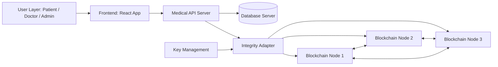

# Healthcare Integrity Ledger

This service is the blockchain layer for the AI-Healthcare Assistant. 

## 📖 Blockchain in Simple Terms
Imagine a highly secure, physical ledger book where entries are written in permanent ink. Every time a page (a "block") is filled, it is mathematically sealed and digitally glued to the previous page. If someone tries to rip out a page or erase a word, the mathematical seal breaks, and everyone on the network instantly knows the book was tampered with. That is a blockchain—a decentralized, append-only, tamper-proof digital ledger.

## 🏥 Why We Adopted It for Healthcare
In the medical field, data integrity is a matter of life and death. If a malicious actor (or an accidental database glitch) alters a past diagnosis, prescription, or surgery note in a standard database, the change might go unnoticed. We adopted blockchain to provide an **indisputable, tamper-proof audit trail** that guarantees medical history cannot be secretly rewritten.

## ⚙️ How It Works in Our App (The Hybrid Approach)
We **do not** store bulky medical records (like X-Rays or full patient text) directly on the blockchain. Doing so would make the network extremely slow and would violate privacy laws like GDPR (which require a "Right to be Forgotten", while blockchains are permanent). 

Instead, we use an enterprise-grade hybrid architecture:
1. **Off-Chain Storage (MongoDB):** The actual medical details and images are stored efficiently in our main database.
2. **On-Chain Audit (This Blockchain):** Every time a medical note is created, we generate a small "cryptographic receipt" (containing the sender, recipient, timestamp, and a digital signature) and save *that receipt* to the blockchain.
    
If someone covertly alters a patient's record in the MongoDB database, the hospital can cross-reference the data against our Blockchain layer. The cryptographic hashes and signatures won't match, instantly proving the database was compromised!

---

## What this service contains

- A lightweight proof-of-work blockchain built from scratch in Node.js.
- A networked API that can run as a single node or sync across multiple peers.
- A verification layer using Ed25519 cryptography to securely sign and verify events.

## Architecture

### Updated system architecture



Design rules:

- Store full medical content in the database layer.
- Store integrity events on-chain (hash, signer, timestamp, reference metadata).
- Keep private keys out of client devices and browser code.
- Treat blockchain commit confirmation as asynchronous.

### Write path

1. Doctor submits a note from the frontend.
2. Medical API validates authorization and input.
3. API stores the medical note in the database.
4. API computes a canonical hash of the stored record.
5. Integrity adapter signs and broadcasts a medical_event to blockchain nodes.
6. Mined block reference (transactionId, block hash/index) is linked back to the record.

### Read and verify path

1. Client requests a note from the API.
2. API returns note data from database.
3. API fetches related integrity event from blockchain.
4. API recomputes hash and compares against on-chain hash.
5. API returns verification status with data (`verified`, `mismatch`, or `pending`).

### Current repository structure

```text
blockchain/
|-- src/
|   |-- core/
|   |   |-- blockchain-ledger.js
|   |-- server/
|   |   |-- node-server.js
|   |-- scripts/
|   |   |-- validate-chain.js
|-- .env.example
|-- package.json
```

### Component responsibilities

- `src/core/blockchain-ledger.js`: chain state, PoW, Merkle root, signature and block validation, chain-work.
- `src/server/node-server.js`: HTTP node API, peer sync, broadcasting, mining, and consensus endpoints.
- `src/scripts/validate-chain.js`: local sanity script for signed_event, medical_event, and system_event.

## Event model

The system uses identity/event language. Some internal keys still use legacy names for compatibility (`transactions`, `transactionId`, `pendingTransactions`).

### Event types

1. medical_event

- Purpose: clinical note events.
- Typical fields: sender, recipient, doctor, date, description.
- Signature required: optional by default (configurable).

2. signed_event

- Purpose: explicitly authorized events.
- Typical fields: sender, recipient, description, publicKey, signature.
- Signature required: yes.

3. system_event

- Purpose: node/system lifecycle events (for example mining records).
- Typical fields: sender set to SYSTEM or 00, recipient, plus description or metadata.
- Signature required: no.

### Example event payloads

Medical event:

```json
{
  "type": "medical_event",
  "sender": "patient-123",
  "recipient": "doctor-456",
  "doctor": "Dr. Ledger",
  "date": "2026-03-17T10:30:00.000Z",
  "description": "Follow-up after surgery"
}
```

Signed event:

```json
{
  "type": "signed_event",
  "sender": "6d9b40f7ab...",
  "recipient": "f921dd88f4...",
  "description": "Authorized record handoff",
  "publicKey": "BASE64_DER_PUBLIC_KEY",
  "signature": "BASE64_SIGNATURE",
  "transactionId": "..."
}
```

System event:

```json
{
  "type": "system_event",
  "sender": "SYSTEM",
  "recipient": "node-identity",
  "description": "Node mined a new block"
}
```

## How the React app uses it

Primary integration points:

- Write flow: react-app/src/components/records/AddDoctorNote.js
  - Submits update to Medical API Server (`PUT /records/:id`)
  - Medical API Server updates the database and acts as the Integrity Adapter
  - Medical API Server broadcasts the event to the blockchain (`POST /transaction/broadcast` and `GET /mine`)

- Read flow: react-app/src/components/records/DoctorNote.js
  - Currently fetches immutable history directly from Blockchain Node (`GET /address/:patientId`)

End-to-end sequence:

1. Doctor submits note.
2. Frontend broadcasts note event.
3. Node validates and queues it.
4. Mining endpoint commits a block.
5. New block is propagated to peers.
6. UI reads immutable history by patient identity.

## API reference

Preferred identity/event routes:

- GET /health
- GET /blockchain
- GET /mempool
- GET /identity/new
- POST /identity/sign-event
- POST /event/verify
- GET /identity/:identity

Core ledger routes (still used by current frontend):

- POST /transaction
- POST /transaction/broadcast
- GET /mine
- GET /consensus
- POST /receive-new-block
- POST /register-and-broadcast-node
- POST /register-node
- POST /register-nodes-bulk
- GET /block/:blockHash
- GET /transaction/:transactionID
- GET /address/:address

Compatibility aliases:

- GET /wallet/new
- POST /wallet/sign-transaction
- POST /transaction/verify

## Quick start

Install dependencies:

```bash
npm install
```

Create environment file:

```bash
cp .env.example .env
```

Run one node:

```bash
npm start
```

Run in watch mode:

```bash
npm run dev
```

Run local multi-node simulation:

```bash
npm run node_1
npm run node_2
npm run node_3
npm run node_4
npm run node_5
```

Run sanity check:

```bash
npm test
```

## Environment variables

```env
PORT=3001
BLOCKCHAIN_NODE_URL=http://localhost:3001
BLOCKCHAIN_DIFFICULTY=4
BLOCKCHAIN_TARGET_BLOCK_TIME_MS=30000
BLOCKCHAIN_ACCEPT_UNSIGNED_MEDICAL_EVENTS=true
# Legacy fallback still supported:
# BLOCKCHAIN_ACCEPT_UNSIGNED_MEDICAL=true
# Optional custom state path:
# BLOCKCHAIN_STATE_PATH=./data/ledger-state.json
```

Notes:

- Lower BLOCKCHAIN_DIFFICULTY for faster local mining.
- Set BLOCKCHAIN_ACCEPT_UNSIGNED_MEDICAL_EVENTS=false once frontend signing is fully enabled.


